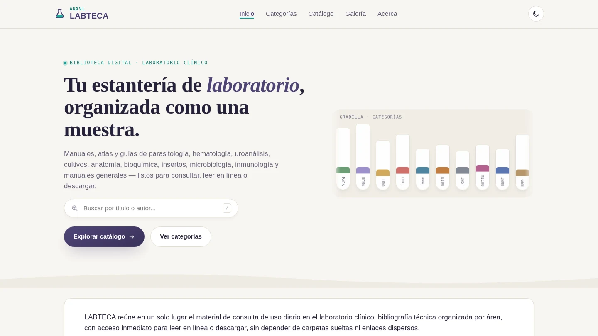
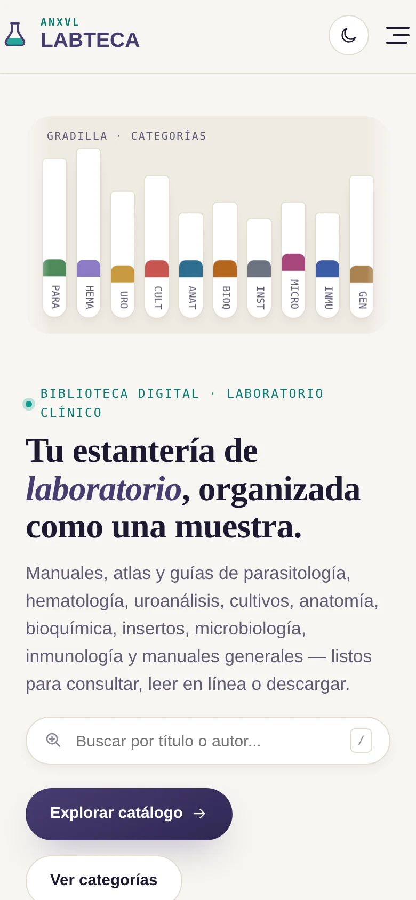

<div align="center">


[](#)
[](#)
[](#)
[](#)
[](#)
[](#)
[](LICENSE)

**Manuales, atlas y guías de laboratorio clínico, organizados como una gradilla de muestras.**
Sin servidor, sin base de datos, sin cuentas — solo HTML, CSS y JavaScript.

[Ver capturas](#-vista-previa) ·
[Características](#-características) ·
[Cómo empezar](#-cómo-empezar) ·
[Guía completa](docs/GUIA-DE-USO.md)

</div>

<br>

## 📖 Acerca del proyecto

**ANXVL LABTECA** es una biblioteca digital para laboratorio clínico:
parasitología, hematología, uroanálisis, cultivos, anatomía, bioquímica,
insertos, microbiología, inmunología y manuales generales, todo
organizado por categoría, con lectura en línea, descarga y una galería de
fotos del laboratorio.

Todo se presenta como una biblioteca propia, con portadas, lector y
descargas integrados en una sola interfaz — sin carpetas sueltas ni
enlaces dispersos.

## 🖼️ Vista previa

<div align="center">


<br><br>

</div>

> Las portadas y las fotos de la galería se cargan en vivo, así que solo
> se ven al abrir el sitio con conexión a internet.

## ✨ Características

**📚 Catálogo** — búsqueda en tiempo real (atajo `/`), filtros por
categoría y por estado de lectura, botón "Al azar" y franja "Retomar
lectura" para volver directo a lo que quedó a medias.

**🔖 Estado de lectura** — marca cada libro como *Leyendo* o *Leído*, con
una barra de progreso general. Se guarda en el navegador, sin cuentas.

**🖼️ Galería** — fotos del laboratorio con paginación fija, visor a
pantalla completa, navegación por teclado y deslizando con el dedo.

**📄 Lector integrado** — visor propio dentro del sitio, con zoom y
aviso claro si un documento no carga.

**🌗 Tema claro / oscuro** — respeta la preferencia del sistema en la
primera visita; el oscuro tiene un fondo animado tipo espacio.

**⚡ Rendimiento cuidado** — sin frameworks, `content-visibility` para
catálogos grandes, transición de tema optimizada (ver
[detalles](docs/GUIA-DE-USO.md#rendimiento)).

**♿ Accesible** — enlace "saltar al contenido", foco atrapado en los
modales, estados `aria-pressed` en los filtros, buen contraste en ambos
temas.

**📱 100% responsive** — probado en escritorio, tablet y móvil, en ambos
temas, sin desbordamientos.

## 🧰 Stack

| | |
|---|---|
| **Frontend** | HTML5, CSS3 (variables, grid, flexbox), JavaScript (ES6+) sin frameworks |
| **Contenido** | Catálogo curado, organizado por categoría |
| **Persistencia local** | `localStorage` (tema y estado de lectura) |
| **Iconos** | SVG propios |
| **Tipografía** | Fraunces, Space Grotesk, IBM Plex Sans/Mono |

## 🏁 Cómo empezar

No requiere instalación, backend ni proceso de build.

**Verlo en tu navegador**
```bash
git clone https://github.com/ANXVL/labteca.git
cd labteca
# abre index.html con doble clic, o con tu editor favorito
```

**Publicarlo con GitHub Pages**
1. `Settings → Pages`
2. Rama `main`, carpeta `/ (root)`
3. Guardar — queda disponible en `https://anxvl.github.io/labteca/`

**Un solo archivo**
Si prefieres compartir un único archivo sin carpetas, usa
`index-completo.html` (todo el CSS y JS ya están incluidos adentro).

## 🗂️ Categorías del catálogo

| Código | Categoría | | Código | Categoría |
|---|---|---|---|---|
| `PARA` | Parasitología | | `INST` | Insertos |
| `HEMA` | Hematología | | `MICRO` | Microbiología |
| `URO` | Uroanálisis | | `INMU` | Inmunología |
| `CULT` | Cultivos | | `BIOQ` | Bioquímica |
| `ANAT` | Anatomía | | `GEN` | Manuales generales |

## 📚 Documentación

La guía técnica completa — cómo agregar libros y fotos, notas de
rendimiento y de la auditoría de código — vive en
[`docs/GUIA-DE-USO.md`](docs/GUIA-DE-USO.md).

## 📄 Licencia

El código de este proyecto se distribuye bajo licencia [MIT](LICENSE).
Los documentos y fotos enlazados no están cubiertos por esta licencia —
son propiedad de sus autores u editoriales originales.

## 👤 Autor

**ANXVL**
[GitHub](https://github.com/ANXVL)

Parte de un portafolio de herramientas propias construidas bajo la misma
filosofía: sin dependencias innecesarias, sin telemetría, sin recolección
de datos — *cero huellas*.

<div align="center">

<sub>Hecho con 🧪 por ANXVL</sub>

</div>
