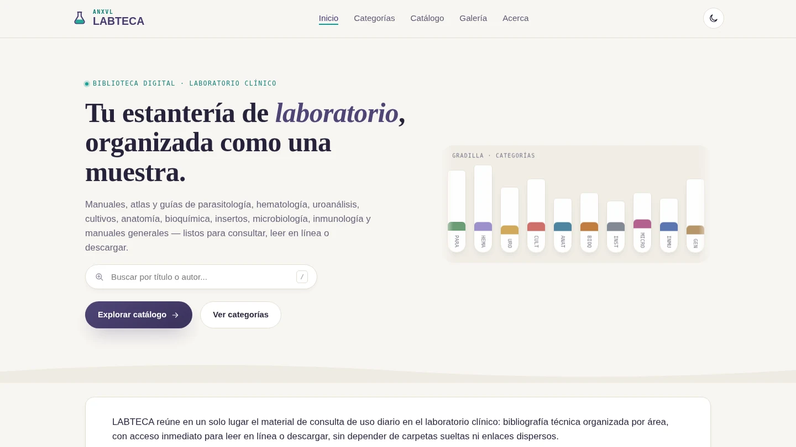

# ANXVL LABTECA

Biblioteca digital de laboratorio clínico: manuales, atlas y guías
organizados por área, con lector integrado, lectura en voz alta, descarga
y galería de fotos.

Sin servidor, sin base de datos, sin cuentas, sin frameworks — solo HTML,
CSS y JavaScript.

## Vista previa




Las portadas y las fotos se cargan desde Google Drive, así que solo se ven
con conexión a internet.

## Qué hace

**Catálogo.** Búsqueda en tiempo real (atajo `/`), filtros por categoría y
por estado de lectura, botón "Al azar" y franja "Retomar" para volver a lo
que quedó a medias.

**Estado de lectura.** Cada libro se marca como *Leyendo* o *Leído*, con
barra de progreso general. Se guarda en el navegador, sin cuentas.

**Lector integrado.** Visor dentro del sitio, con zoom propio y aviso claro
si un documento no carga.

**Lectura en voz alta.** Botón de altavoz dentro del lector: lee el PDF y
avanza solo de página en página hasta terminarlo. Salta las páginas sin
texto, recuerda dónde quedaste, permite cambiar velocidad y voz, y puede ir
resaltando la frase que suena. Detalles en
[`docs/LECTURA-EN-VOZ.md`](docs/LECTURA-EN-VOZ.md).

**Galería.** Fotos del laboratorio con paginación fija, visor a pantalla
completa, navegación por teclado y deslizando con el dedo.

**Tema claro / oscuro.** Respeta la preferencia del sistema en la primera
visita; el oscuro tiene fondo animado.

**Accesibilidad.** Enlace "saltar al contenido", foco atrapado en los
modales, estados `aria-pressed` en los filtros, contraste cuidado en ambos
temas.

**Responsive.** Probado en escritorio, tablet y móvil, en ambos temas.

## Stack

| | |
|---|---|
| Frontend | HTML5, CSS3 (variables, grid, flexbox), JavaScript ES6+ sin frameworks |
| Lectura de PDF | PDF.js, cargado desde CDN solo al pulsar "Escuchar" |
| Voz | Web Speech API del navegador |
| Persistencia local | `localStorage` (tema, estado de lectura, posición de la voz) e IndexedDB (PDF ya leídos) |
| Iconos | SVG propios |
| Tipografía | Fraunces, Space Grotesk, IBM Plex Sans/Mono |

## Cómo empezar

No requiere instalación, backend ni proceso de build.

```bash
git clone https://github.com/ANXVL/labteca.git
cd labteca
python3 -m http.server 8000      # y abre http://localhost:8000
```

Conviene servirlo por HTTP y no abrir `index.html` con doble clic: con
`file://` el navegador bloquea la lectura de PDF y la voz no funciona.

**Publicarlo con GitHub Pages**

1. `Settings → Pages`
2. Rama `main`, carpeta `/ (root)`
3. Queda disponible en `https://anxvl.github.io/labteca/`

## Categorías

| Código | Categoría | | Código | Categoría |
|---|---|---|---|---|
| `PARA` | Parasitología | | `INST` | Insertos |
| `HEMA` | Hematología | | `MICRO` | Microbiología |
| `URO` | Uroanálisis | | `INMU` | Inmunología |
| `CULT` | Cultivos | | `BIOQ` | Bioquímica |
| `ANAT` | Anatomía | | `GEN` | Manuales generales |

## Documentación

- [`docs/GUIA-DE-USO.md`](docs/GUIA-DE-USO.md) — cómo agregar libros y
  fotos, notas de rendimiento y de la auditoría de código.
- [`docs/LECTURA-EN-VOZ.md`](docs/LECTURA-EN-VOZ.md) — cómo funciona la
  lectura en voz alta y de dónde saca los PDF.

## Licencia

El código se distribuye bajo licencia [MIT](LICENSE). Los documentos y
fotos enlazados no están cubiertos: son propiedad de sus autores u
editoriales originales.

## Autor

ANXVL — [github.com/ANXVL](https://github.com/ANXVL)
